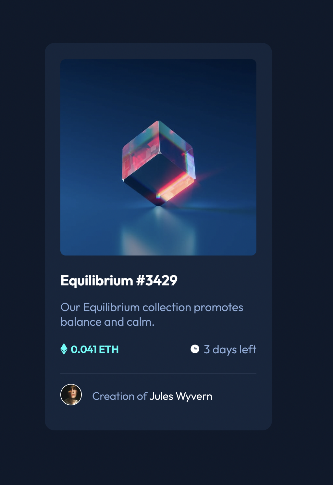

# Frontend Mentor - NFT preview card component solution

This is a solution to the [NFT preview card component challenge on Frontend Mentor](https://www.frontendmentor.io/challenges/nft-preview-card-component-SbdUL_w0U). Frontend Mentor challenges help you improve your coding skills by building realistic projects.

## Table of contents

- [Overview](#overview)
  - [The challenge](#the-challenge)
  - [Screenshot](#screenshot)
  - [Links](#links)
- [My process](#my-process)

  - [Built with](#built-with)
  - [What I learned](#what-i-learned)
  - [Continued development](#continued-development)

- [Author](#author)
- [Acknowledgments](#acknowledgments)

## Overview

NFT Card Component created by using HTML and plain CSS

### The challenge

Users should be able to:

- View the optimal layout depending on their device's screen size
- See hover states for interactive elements

### Screenshot

### Links

- Solution URL: [https://github.com/andreaslarssamils/nft-card-component](https://github.com/andreaslarssamils/nft-card-component
- Live Site URL: [https://andreaslarssamils.github.io/nft-card-component/](https://andreaslarssamils.github.io/nft-card-component/)

## My process

### Built with

- HTML5
- CSS
- Flexbox

### What I learned

I have used basic html and css, which have reinforced my knowledge about html css.

### Continued development

I will come back to this project and fix opacity problem with the eye icon. The icon is supposed to be white. I don't know how to do it so if there is any who know how to solve it you are very welcome to explain on how to do it.

## Author

- Frontend Mentor - [@andreaslarssamils](https://www.frontendmentor.io/profile/andreaslarssamils)

## Acknowledgments

Thank you frontend mentor
